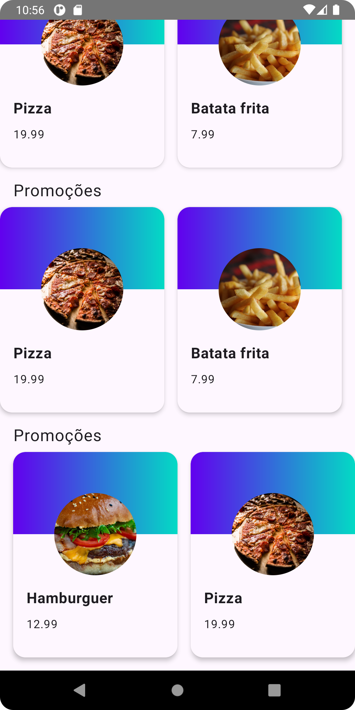

# Notes

- Poc De estudo para aprender o básico de layout com o **_Compose_**
  

### Clip:

- Formatar imagens nos quais diferem do formato padrão do android
- Link: https://foso.github.io/Jetpack-Compose-Playground/cookbook/how_to_create_custom_shape/

### Reutilização de Composables

- Sempre há como reutilizar componentes que se repetem em várias áreas, assim como no flutter os
  quais se repetem é de boa prática que se façam componentes que possam ser reutilizados em vários
  lugares diferentes.

### Lazy Layout

- Doc: https://developer.android.com/develop/ui/compose/lists

- No lugar de percorrer com o for a lista de produtos o que seria uma simulação de um RecyclweView
  para os sistemas de views. Usamos nesse caso o Lazy Layout:
    - Implementação de rolagem por padrão;
    - Garantia de performance mesmo com diversos dados;
    - Personalizações de diferentes layouts, como por exemplo, o Grid

### State Holder:
- o conceito de State Holder refere-se a um padrão onde o estado da interface de usuário (UI) é
  mantido e gerenciado em um local centralizado, para que possa ser facilmente acessado e atualizado
  pelos componentes da UI. Um State Holder é uma entidade que detém o estado da UI e pode ser
  responsável por expor e atualizar esse estado de maneira eficiente e reativa.
- Mantem todos os dados/gerenciam os que precisam aparecer na nossa tela.